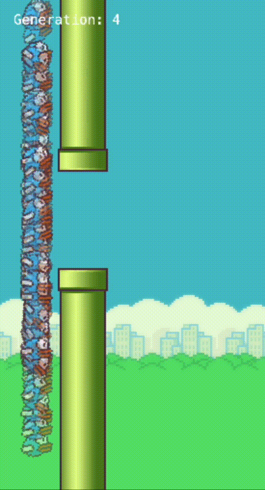

# Evolve Flappy Birds

A bunch of flappy birds learn what it means to die



## Why?

I initially created a clone of Flappy Bird to learn the Kaboom game engine (now deprecated, I'm now using the community fork Kaplay). I was also quite invested in the [Nature of Code](https://natureofcode.com/) by Daniel Shiffman, and I quickly realized that implementing genetic algorithms was really quite trivial when applied to training small neural networks. As I was learning, I ended up creating a feedforward neural network trained by a genetic algorithm without really understanding the math - in fact, I treated each layer as an array of nodes connected to other nodes, rather than using matrix multiplication.

## Usage

```bash
pnpm install
pnpm run dev
```
